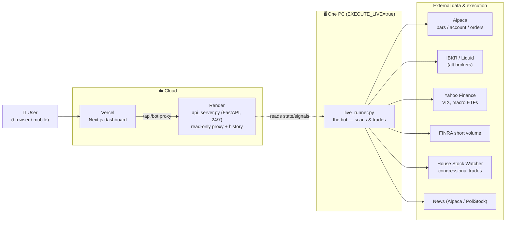
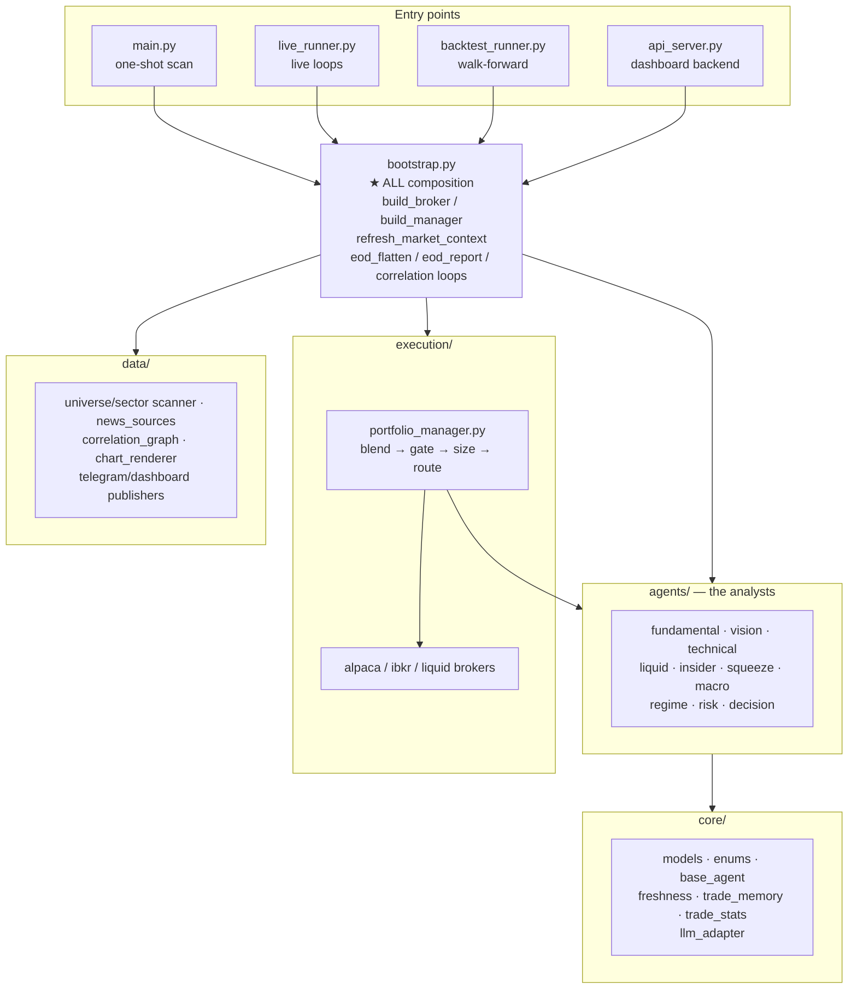
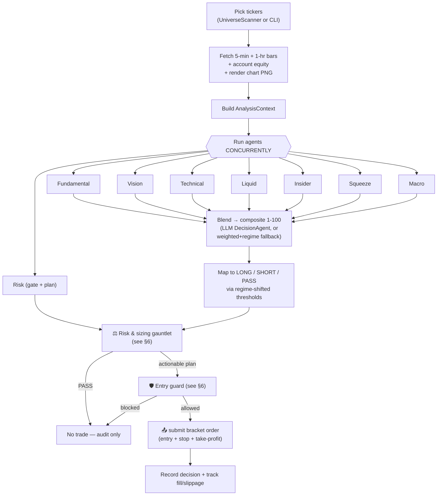
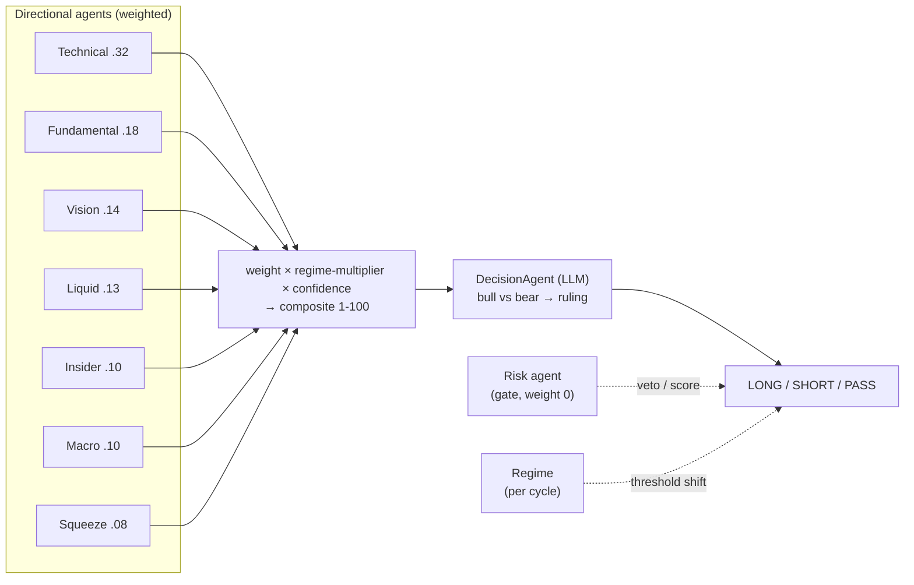
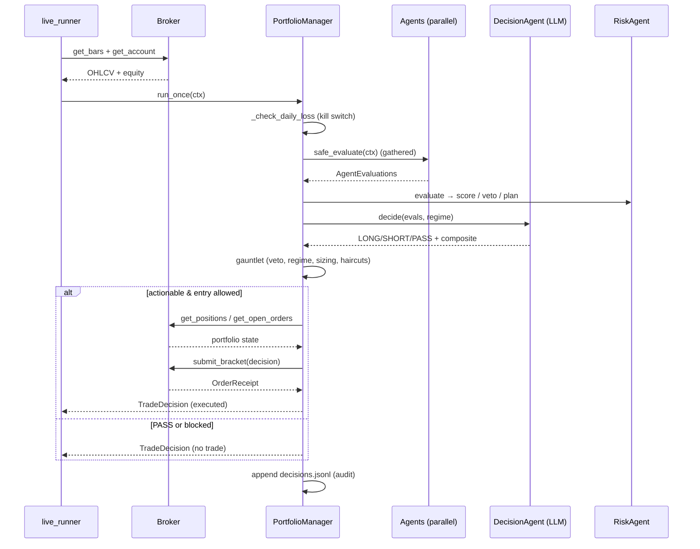
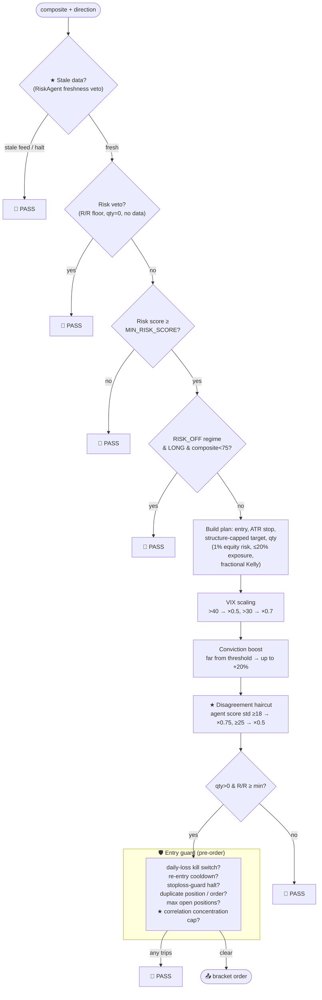
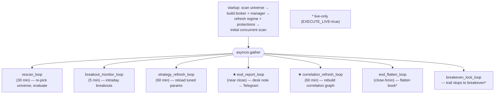

# How the Trading Bot Works

A visual walkthrough of the system, from deployment topology down to a single
trade decision. Diagrams are [Mermaid](https://mermaid.js.org/) — they render
automatically on GitHub.

> TL;DR: a fleet of specialist **agents** each score a stock 1–100, the
> **PortfolioManager** blends those scores into a direction, a gauntlet of
> **risk gates** can shrink or veto the trade, and the surviving plan is sent
> to a **broker** as a bracket order. A dashboard shows everything; the user
> can require manual approval per trade.

---

## 1. Deployment topology

Where the pieces physically run.

- **Only one PC** runs with `EXECUTE_LIVE=true` (shared Alpaca account).
- The dashboard never trades directly — it talks to the Render API, which
  surfaces the bot's signals and history. Live order routing happens on the PC.

---

## 2. Code map

Everything is wired in **`bootstrap.py`** so the runners can't drift apart.

---

## 3. The core pipeline — per ticker

The heart of the system: from raw bars to a routed order.

Once-per-cycle context (shared by all tickers): the **RegimeAgent** sets the
market regime and the **MacroAgent** caches macro signals; SPY bars are injected
into the TechnicalAgent for relative strength.

---

## 4. The agent ensemble

Each agent returns an `AgentEvaluation` — a score (1 = max bearish, 50 = neutral,
100 = max bullish), a confidence, an optional veto, and rationale.

| Agent | Default weight | What it reads | Signal |
|-------|:---:|---|---|
| **Technical** | 0.32 | bars (+SPY) | RSI/MACD/EMA/VWAP, rel-strength, volume surge, intraday momentum, candlesticks |
| **Fundamental** | 0.18 | news + LLM | news sentiment, earnings/catalyst scoring (keyword fallback) |
| **Vision** | 0.14 | chart PNG + vision LLM | chart-pattern recognition from the rendered candlestick image |
| **Liquid** | 0.13 | bars | relative volume, spread quality, momentum proxy |
| **Insider** | 0.10 | House Stock Watcher | congressional buying (needs ≥2 technical confirmations) |
| **Macro** | 0.10 | Yahoo (BTC/QQQ/XLP/GLD/UUP) | risk-on/off regime, cached 30 min, shared by all tickers |
| **Squeeze** | 0.08 | FINRA short volume | short-squeeze setups (short ratio + rel-vol) |
| **Risk** | gate (0) | bars + account | sizing, SL/TP, R/R, **veto authority** — not part of the directional blend |
| **Regime** | per-cycle | Yahoo VIX + SPY/QQQ | tightens/loosens LONG & SHORT thresholds |
| **Decision** | meta | all evals + memory | LLM "Chief Decision Officer" — debates bull/bear, rules LONG/SHORT/PASS |

---

## 5. One evaluation cycle (sequence)

---

## 6. The risk & sizing gauntlet

Every potential trade runs this gauntlet. Boxes marked **★ NEW** were added in
the recent MiroFish-inspired work. Anything that hits a 🛑 becomes a PASS.

**Sizing math (RiskAgent):** `risk_$ = equity × 1% × volatility_mult × kelly_mult`,
stop = `ATR × stop_multiple`, target capped at session high/low so R/R stays
variable (a constant R/R would make the min-R/R veto a no-op). **Fail closed:**
no verified equity ⇒ no plan.

---

## 7. Live runner: concurrent loops

`live_runner.py` runs many `asyncio` loops at once after the initial scan.

Per-ticker evaluations are throttled by a semaphore (max 10 concurrent). Orders
fire automatically **only** when `EXECUTE_LIVE=true` **and** the dashboard's
auto-execute toggle is on; otherwise signals are published for manual approval.

---

## 8. Safety layers (defense in depth)

```mermaid
flowchart LR
    subgraph perTrade["Per-trade"]
        a["Stale-data veto ★"]
        b["R/R + sizing veto"]
        c["Min risk score"]
        d["Disagreement haircut ★"]
        e["VIX scaling"]
    end
    subgraph portfolio["Portfolio"]
        f["Duplicate-position guard"]
        g["Max open positions"]
        h["Correlation cap ★"]
        i["Re-entry cooldown"]
        j["Stoploss-guard (loss streak)"]
    end
    subgraph account["Account / session"]
        k["Daily-loss kill switch"]
        l["Intraday drawdown halt"]
        m["EOD flatten"]
    end
    perTrade --> portfolio --> account
```

Guiding principle throughout: **fail closed** — when state is unknown (no
equity, stale bars, broker error), the bot refuses to trade rather than guessing.

---

## 9. Recent additions (MiroFish-inspired)

| ★ Feature | Where | Effect |
|---|---|---|
| **Stale-data veto** | `core/freshness.py`, RiskAgent | refuses to size against halted / stale / weekend bars |
| **Disagreement haircut** | PortfolioManager | shrinks size when agents strongly conflict (low conviction) |
| **EOD ReportAgent** | `agents/report_agent.py`, `bootstrap.eod_report_loop` | daily desk note from the audit log + trade stats + memory |
| **Correlation graph** | `data/correlation_graph.py`, `bootstrap.correlation_refresh_loop` | concentration cap uses real return-correlation, not a static list |

See `.claude/completions/2026-06-21-mirofish-inspired-risk-and-reporting.md`.
